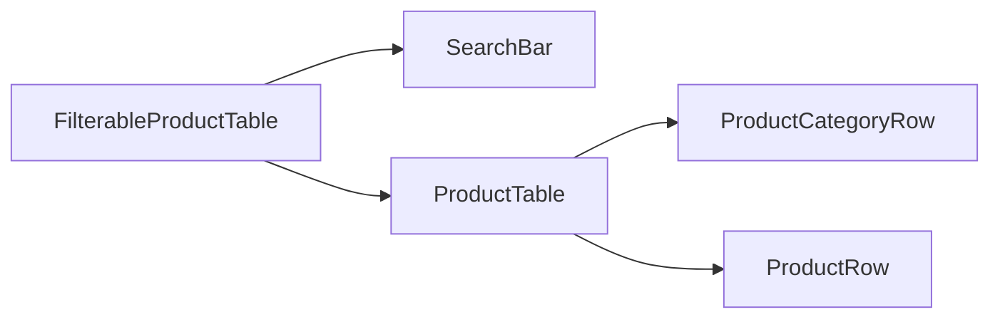

# Thinking React

Building a UI with React makes you think differently about it:

1. You will break it apart into different components.
2. You will describe the different VFX for each component.
3. Connect the data pipes to the components.

## Starting with the mockup

Imagine the scenario: there is already an API that returns JSON data, and a mockup given by a designer:

The API returns data that looks like this:

```json
[
  { "category": "Fruits", "price": "$1", "stocked": true, "name": "Apple" },
  {
    "category": "Fruits",
    "price": "$1",
    "stocked": true,
    "name": "Dragon-fruit"
  },
  {
    "category": "Fruits",
    "price": "$2",
    "stocked": false,
    "name": "Passion-fruit"
  },
  {
    "category": "Vegetables",
    "price": "$2",
    "stocked": true,
    "name": "Spinach"
  },
  {
    "category": "Vegetables",
    "price": "$4",
    "stocked": false,
    "name": "Pumpkin"
  },
  { "category": "Vegetables", "price": "$1", "stocked": true, "name": "Peas" }
]
```

And the mockup looks like this:


To implement a UI in React, you will need to follow 5 steps.

## Step 1: Break the UI into a hierarchy of components

Start by drawing boxed around every component and sub-component, and name them. There are different ways to approach this division in the thought process:

- Programming: use the same technics for deciding if you need a function or an object, like the [Single Responsibility Principle](https://en.wikipedia.org/wiki/Single-responsibility_principle) (applied to React: a component should only do one thing).
- CSS: consider what you would make class selectors for.
- Design: consider how you would organize the design's layers.

Another thing to keep in mind, is that the UI and the Data Models have often the same information architecture. Separate your component so that each components matches a data model.

There are five components on this screen:


1. FilterableProductTable (grey) contains the entire app.
2. SearchBar (blue) receives the user input.
3. ProductTable (lavender) displays and filters the list according to the user input.
4. ProductCategoryRow (green) displays a heading for each category.
5. ProductRow (yellow) displays a row for each product.

Now, arranging it into a hierarchy we would get:



## Step 2: Building a Static version in React

A great place to start building your app is with a static version of it: a static version requires a lot of typing but not a lot of thinking, but an interactive version requires a lot of thinking, not a lot of typing. And building the styles and design of the app will allow to add the interactions easier.

To build this static version, you will like to implement different components that reuse others component's data via props.

You can either build it "top down", by starting with the highest component hierarchy, or "bottom up", by working on the components lower down. In simpler examples is easier to go "top down", and on large projects is easier to go "bottom up".

After building the components, you will have a library of reusable components that render the data model.

## Step 3: Finding minimal but complete representation of UI state

To make a UI interactive, users need to be able to change the underlying data models. This can be done with states. States are the minimal set of changing data the app needs to remember. The most important principle for structuring states is to keep it [DRY (Don't Repeat Yourself)](https://en.wikipedia.org/wiki/Don%27t_repeat_yourself). Figure out the absolute minimal representation of the state your application needs and compute everything else on demand.

Identifying the states the application needs can be done as follows:

1. Think of the pieces of data in the application:
   - The original list of products.
   - The search text the user has entered.
   - The value of the checkbox.
   - The filtered list of products.
2. Identify what's not a state:
   - Does it remain unchanged over time? If so, it is not a state.
   - Is it passed in from a parent via props? If so, it is not a state.
   - Can you compute it based on existing state or props in your component? If so, it is not a state.
3. Obtain the states:
   - [ ] The original list of products is a prop.
   - [x] The search text changes over time, is not a prop, and cant be computed.
   - [x] The value of the checkbox changes over time, is not a prop, and cant be computed.
   - [ ] The filtered list can be computed by other values.

So only the search box and the checkbox are states.

## Step 4: Identify where your state should live

After identifying the app's minimal state you need to identify which component needs to own the state. Remember that React uses one-way data flows, passing down data down in the hierarchy. For each piece of state in the application:

1. Identify every component that renders something based on that state.
2. Find their closest common parent component.
3. Decide where the state should live:
4. It often can live directly in the common parent.
5. Or also in some component above the common parent.
6. If there is no component where it makes sense to own the state, create a new component above the common parent solely for holding the state.

In the previous step, you found 2 pieces of state in this application: the search input text, and the value of the checkbox. In the application, they always appear together, so it makes sense to put them into the same place.

1. Identify the components that use state:
   - `ProductTable` needs to filter the product list based on that state (search text + checkbox value).
   - `SearchBar` needs to display that state (search text + checkbox value).
2. Find their common parent: The first common parent is `FilterableProductTable`.
3. Decide where the state lives: it will live in `FilterableProductTable`.

Add state to the component with the [`useState()` hook](https://react.dev/reference/react/useState).

```typescript
function FilterableProductTable({ products }) {
    const [filterText, setFilterText] = useState('');
    const [inStockOnly, setInStockOnly] = useState(false);

    { ... }
}
```

Then pass the states as props to each component:

```tsx
<div>
  <SearchBar filterText={filterText} inStockOnly={inStockOnly} />
  <ProductsTable
    products={products}
    filterText={filterText}
    inStockOnly={inStockOnly}
  />
</div>
```

At the moment, the code will `error`, because there is no handler for the user input yet, but the logic for filtering the table is in place already.

## Step 5: Add inverse data flow

To add support for a two-way data flow, React requires it to be explicit. For this, you need to pass the `setFilterText` and `setInStockOnly` functions as props to the `SearchBar`, because it needs to be able to change their value.

And inside the `SearchBar` you will add the `onChange` event handlers and set the parent state from them.

```jsx
function FilterableProductTable({ products }) {
  ...

  return (

    <SearchBar
      filterText={filterText}
      inStockOnly={inStockOnly}
      onFilterTextChange={setFilterText}
      onInStockOnlyChange={setInStockOnly} />
    ...
  );
}
```

```jsx
<input
  type="text"
  value={filterText}
  placeholder="Search..."
  onChange={(e) => onFilterTextChange(e.target.value)}
/>
```

Now the application fully works!
