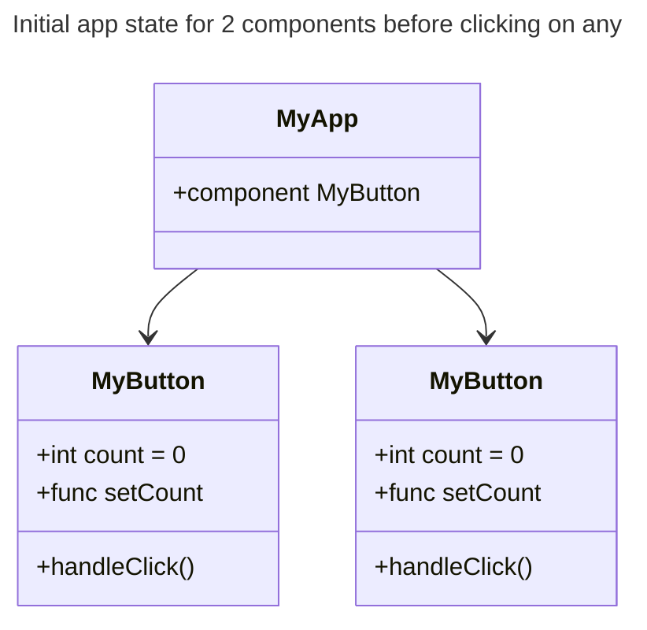
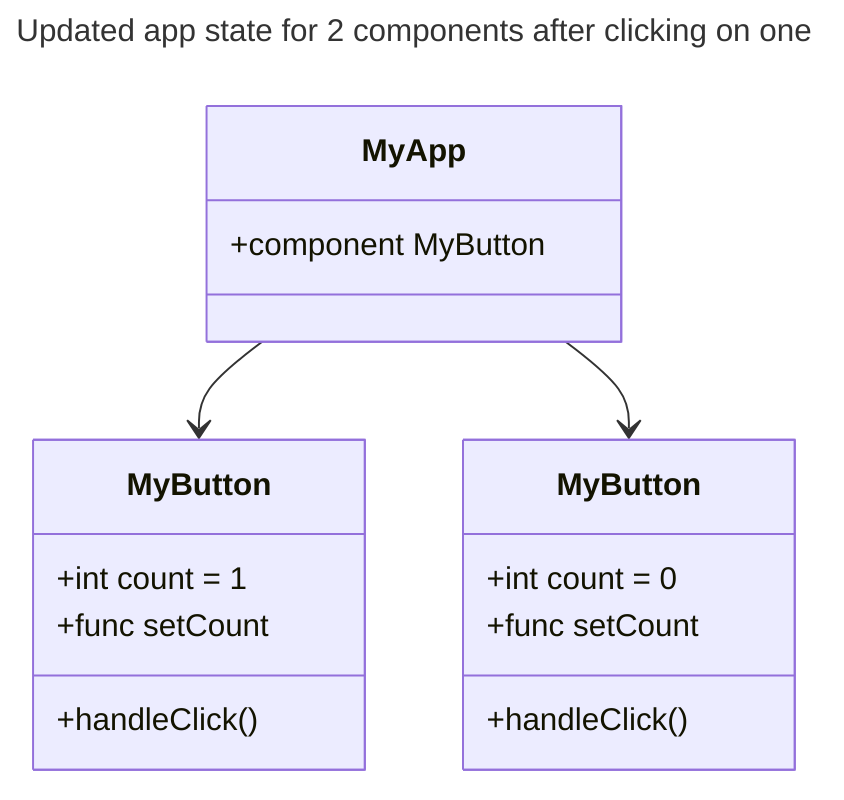
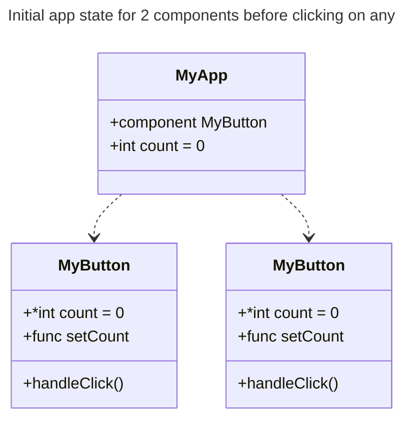
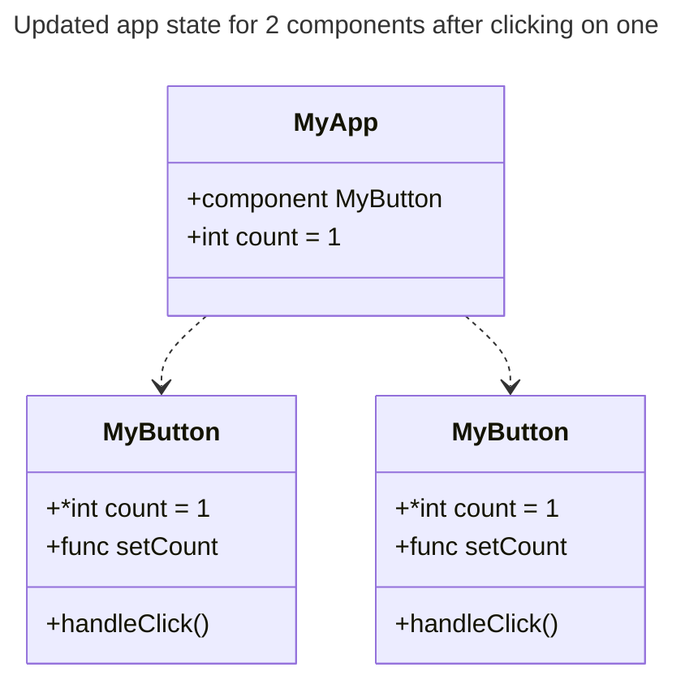

# Quick Start

<!-- https://react.dev/learn -->

## Creating and nesting components

React apps are made of components (UI pieces) that have their own logic and appearance. The components are JavaScript functions that return markups.

```js
function MyButton() {
  return <button>I'm a button</button>;
}
```

This component can be nested into another component:

```js
export default function MyApp() {
  return (
    <div>
      <h1>Welcome to my app</h1>
      <MyButton />
    </div>
  );
}
```

> React components always start with a capital letter. This helps differentiate them from usual HTML tags (which start with lowercase).

## Writing markup with JSX

JSX is the markup syntax used in React to return markups from the components. It is stricter that HTML (obligatory close of different tags used, for example).

Components can only return one JSX tag. To return multiple, they need to be wrapped in a parent tag (that can be a `<div> ... </div>` or an empty `<> ... </>`).

```js
function ThisWorks() {
  return <p>I'm a Component</p>;
}

function ThisAlsoWorks() {
  return (
    <>
      <p>I'm a Component</p>
      <p>I'm another Component</p>
    </>
  );
}

function ThisDoesNotWorks() {
  return (
      <p>I'm a Component</p>
      <p>I'm another Component</p>
  );
}
```

> If you have a lot of HTML to port to JSX, you can use an [online converter](https://transform.tools/html-to-jsx).

## Adding styles

In React, you specify a CSS class with className. It works the same way as the HTML class attribute:

```html

```

Then you write the CSS rules for it in a separate CSS file:

```css
.avatar {
  border-radius: 50%;
}
```

## Displaying data

To use javascript inside JSX, wrap the expression inside curly braces (`{exp}`). This can be used anywhere inside JSX:

```js
const user = {
  name: "Hedy Lamarr",
  imageUrl: "https://i.imgur.com/yXOvdOSs.jpg",
  imageSize: 90,
};

export default function Profile() {
  return (
    <>
      <h1>{user.name}</h1>
      
    </>
  );
}
```

> `style={{}}` is not a special syntax, but a regular `{}` object inside the `style={ }` JSX curly braces.

## Conditional rendering

You'll use the same techniques as you use when writing regular JavaScript code: a conditional statement. You can use `if ... else` blocks,

```js
let content;
if (isLoggedIn) {
  content = <AdminPanel />;
} else {
  content = <LoginForm />;
}
return <div>{content}</div>;
```

the `?` operator,

```js
<div>{isLoggedIn ? <AdminPanel /> : <LoginForm />}</div>
```

or if you don't need the else branch, the `&&` operator".

```js
return <div>{isLoggedIn && <AdminPanel />}</div>;
```

## Rendering lists

This will rely on `for` loops and the array `map()` function to render a list of components.

```js
// given an array of products
const products = [
  { title: "Cabbage", isFruit: false, id: 1 },
  { title: "Garlic", isFruit: false, id: 2 },
  { title: "Apple", isFruit: true, id: 3 },
];

export default function ShoppingList() {
  // use the map() function to transform an array
  // of products into an array of <li> items:
  const listItems = products.map((product) => (
    <li
      key={product.id}
      style={{
        color: product.isFruit ? "magenta" : "darkgreen",
      }}
    >
      {product.title}
    </li>
  ));

  return <ul>{listItems}</ul>;
}
```

## Responding to events

You can respond to events by declaring event handler functions inside your components:

```js
function MyButton() {
  function handleClick() {
    alert("You clicked me!");
  }

  // Do not call the event handler function: you only need to pass it down.
  return <button onClick={handleClick}>Click me</button>;
}
```

## Updating the screen

To make components store information based on certain events, add `state` to the component:

```js
import { useState } from "react";

function MyButton() {
  // use state returns 2 things:
  // - the current state (count)
  // - the function that updates the state (setCount)
  // the initial state is the argument passed into useState(arg).
  const [count, setCount] = useState(0);

  function handleClick() {
    setCount(count + 1);
  }

  // if you render multiple components
  // each will handle their own count
  // > the data is not shared
  return <button onClick={handleClick}>Clicked {count} times</button>;
}
```





## Using Hooks

Functions starting with `use` are called Hooks. React provides [built-in hooks](https://react.dev/reference/react). You can write custom hooks by combining existing ones.

Hooks are more restrictive than other functions. You can only call Hooks at the top of your components (or other Hooks). If you want to use `useState` in a condition or a loop, extract a new component and put it there.

## Sharing data between components

Often you’ll need components to share data and always update together.

From the previous example, to make both MyButton components display the same count and update together, you need to move the state from the individual buttons "upwards" to the closest component containing all of them.

In this example, it is MyApp:





Now when you click either button, the count in MyApp will change, which will change both of the counts in MyButton.

```js
function MyButton({ count, onClick }) {
  // now the functions takes in the count and the update function
  // as argument and builds the component with them.
  // the arguments for components are defined as an one object
  return <button onClick={onClick}>Clicked {count} times</button>;
}

export default function MyApp() {
  const [count, setCount] = useState(0);

  function handleClick() {
    setCount(count + 1);
  }

  // to pass parameters to components it is done with
  // the following syntax
  // The information you pass down like this is called props
  return (
    <div>
      <h1>Counters that update together</h1>
      <MyButton count={count} onClick={handleClick} />
      <MyButton count={count} onClick={handleClick} />
    </div>
  );
}
```
